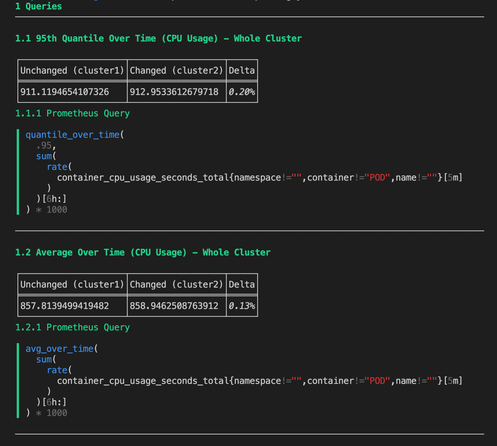

# Promdiff

Very simple cli tool to query two instances of prometheus and show the difference in `markdown/jira/text`. Core use case is measuring differences between two running k8s clusters where you make slight alterations and need to see cluster wide differences.

> :warning:
> Does not support any queries that don't out put single vector values, this tool is born out of needing an easier way to measure something specific.

### CLI Flags

```
Usage of promdiff:
  -c string
        config file to use (default "prom.yaml")
  -f string
        output file to save data (default: stdout)
  -lp int
        left hand padding markdown print out (only used when printing to markdown stdout)
  -o string
        output format (ex. markdown, jira, text) (default "markdown")
  -t string
        custom template file to use
  -w int
        line width for markdown print out (only used when printing to markdown stdout) (default 90)
```

### Example Config

```yaml
# prometheus instances
unchanged:
  name: "my-unchanged server"
  port: 5050
  host: # <default is https://localhost>
  token: >-
    <jwt bearer token for prometheus instance>
changed:
  name: "my changed server"
  port: 5555
  host: # <default is https://localhost>
  token: >-
    <jwt bearer token for prometheus instance>

# example queries
queries:
  - name: 95th Quantile Over Time (CPU Usage) - Whole Cluster
    query: |
      quantile_over_time(
        .95,
        sum(
          rate(
            container_cpu_usage_seconds_total{namespace!="",container!="POD",name!=""}[5m]
          )
        )[6h:]
      ) * 1000

  - name: Average Over Time (CPU Usage) - Whole Cluster
    query: |
      avg_over_time(
        sum(
          rate(
            container_cpu_usage_seconds_total{namespace!="",container!="POD",name!=""}[5m]
          )
        )[6h:]
      ) * 1000
```

### Example output


